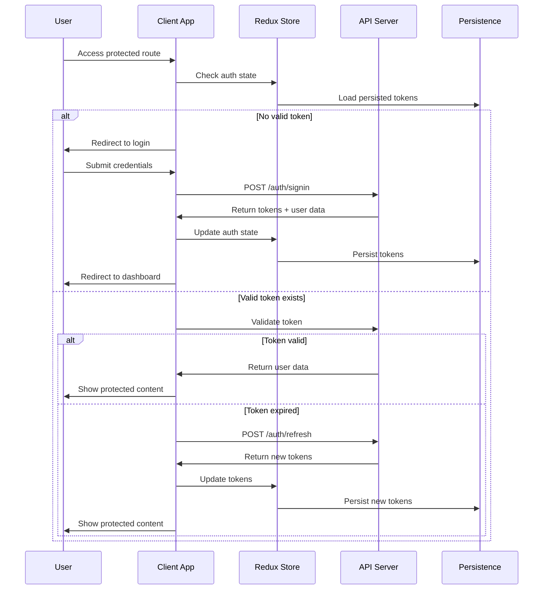
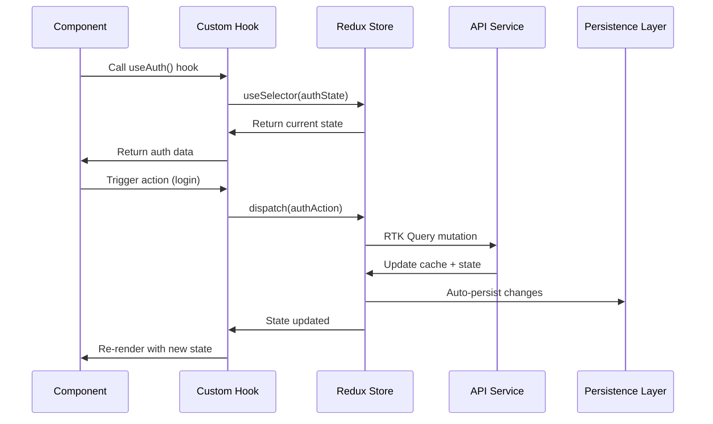
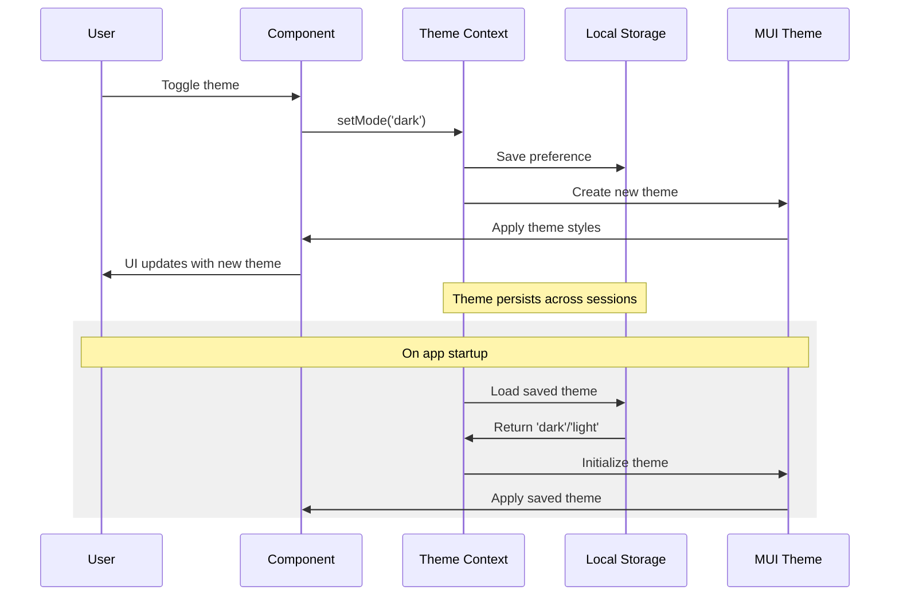
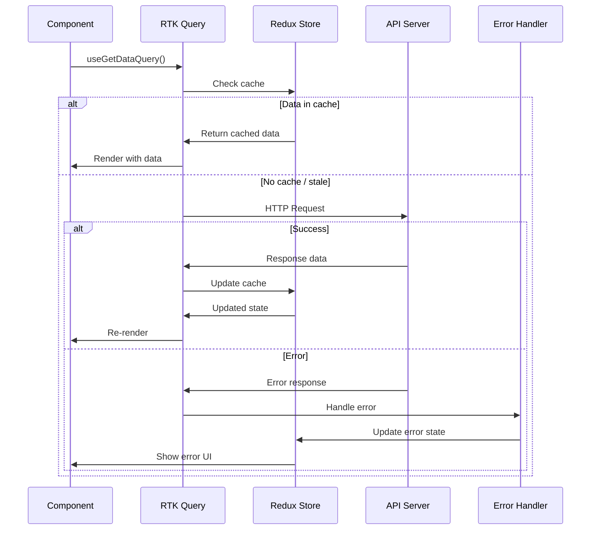
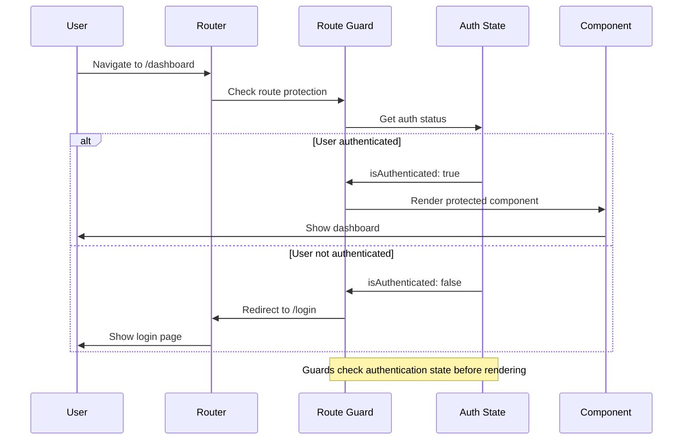
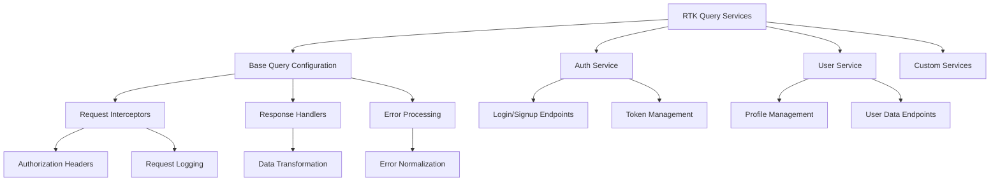
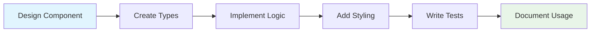
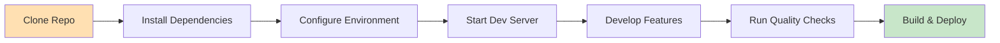

# SM-UI - Modern React Application Boilerplate

A comprehensive React + TypeScript + Vite application boilerplate designed for building scalable web applications. Features complete user management, state persistence, theming, and extensible architecture patterns for rapid development.

## 🚀 Features

- **User Management System**: Complete user lifecycle with profile management
- **Route Protection**: Intelligent route guards with automatic navigation
- **Dashboard Interface**: Customizable dashboard with user-specific content
- **Theme System**: Dynamic light/dark mode with persistent preferences
- **State Management**: Robust state handling with persistence and caching
- **Type Safety**: Comprehensive TypeScript coverage with custom definitions
- **Modern Tooling**: Fast development with hot reload and code quality tools
- **Responsive Design**: Mobile-first approach with flexible layouts
- **API Integration**: Structured API layer with automatic error handling
- **Development Experience**: Enhanced DX with debugging tools and linting

## 🛠 Technology Stack

### Core Framework

- **React 19** - Latest React with concurrent features
- **TypeScript** - Full type safety and developer experience
- **Vite** - Fast build tool and development server

### State Management & Data Fetching

- **Redux Toolkit** - Modern Redux with simplified syntax
- **RTK Query** - Powerful data fetching and caching
- **Redux Persist** - Automatic state persistence to localStorage
- **React Redux** - React bindings for Redux

### UI & Styling

- **Material-UI (MUI) v6** - Complete component library
  - `@mui/material` - Core components
  - `@mui/icons-material` - Icon library
  - `@emotion/react` & `@emotion/styled` - CSS-in-JS styling
- **Custom Theme System** - Light/dark mode with consistent design tokens

### Routing & Navigation

- **React Router v7** - File-based routing with nested routes
- **Protected Routes** - Authentication-based route guards
- **Public Routes** - Redirect authenticated users appropriately

### Development Tools

- **Vite Plugins**:
  - `@vitejs/plugin-react` - React support with Fast Refresh
  - `vite-tsconfig-paths` - TypeScript path mapping
  - `vite-plugin-svgr` - SVG as React components
- **@locator/runtime** - Component location debugging
- **ESLint** - Code linting with React and TypeScript rules

### HTTP & API

- **Axios** - HTTP client for API requests
- **JWT Decode** - JWT token handling
- **RTK Query** - Automated API state management

### Utilities

- **Moment.js** - Date and time manipulation
- **Redux Persist** - State persistence across sessions

## 🚀 Quick Start

### Prerequisites

- Node.js (v18+ recommended)
- npm or yarn

### Installation

```bash
# Clone the repository
git clone <repository-url>
cd sm-ui

# Install dependencies
npm install
# or
yarn install
```

### Environment Setup

Create a `.env` file in the root directory:

```env
# API Configuration
VITE_API_BASE_URL=http://localhost:3001/api
VITE_APP_URL=http://localhost:5173
VITE_WS_BASE_URL=ws://localhost:3001
VITE_ENV_MODE=development
```

### Development

```bash
# Start development server
npm run dev
# or
yarn dev
```

Open [http://localhost:5173](http://localhost:5173) in your browser.

### Production Build

```bash
# Type check and build
npm run build
# or
yarn build

# Preview production build
npm run preview
# or
yarn preview
```

### Code Quality

```bash
# Run ESLint
npm run lint
# or
yarn lint
```

## 📁 Project Architecture

### Directory Structure

```
src/
├── @types/                 # TypeScript type definitions
│   ├── auth.d.ts           # Authentication-related types
│   └── global.d.ts         # Global type declarations
├── app/                    # Redux store and global state
│   ├── store.ts            # Store configuration with persistence
│   ├── hooks.ts            # Typed Redux hooks
│   ├── auth.ts             # Auth selectors and exports
│   ├── features/           # Redux slices
│   │   └── auth.slice.ts   # Authentication state slice
│   ├── selectors/          # Reselect selectors
│   │   └── auth.selectors.ts
│   └── services/           # RTK Query API services
│       ├── auth.service.ts # Authentication API endpoints
│       ├── user.service.ts # User management API
│       ├── checkToken.ts   # Token validation utilities
│       └── queryUtils.ts   # Shared query utilities
├── assets/                 # Static assets
│   └── react.svg
├── config/                 # Configuration files
│   ├── index.ts            # Environment variables and constants
│   ├── constants.ts        # Application constants
│   └── theme.ts            # Material-UI theme factory
├── contexts/               # React Context providers
│   ├── ThemeContext.tsx    # Theme provider with persistence
│   ├── theme.context.ts    # Theme context definition
│   └── useThemeMode.ts     # Theme mode hook
├── pages/                  # Route components
│   ├── auth/
│   │   └── AuthPage.tsx    # Authentication page wrapper
│   ├── dashboard/
│   │   ├── Dashboard.tsx   # Main dashboard page
│   │   └── MeShow.tsx      # User profile component
│   └── error/
│       └── NotFoundPage.tsx # 404 error page
├── routes/                 # Routing configuration
│   └── index.tsx           # Route definitions and guards
├── shared/                 # Reusable components and utilities
│   ├── components/
│   │   ├── ToggleTheme.tsx # Theme toggle component
│   │   └── auth/           # Authentication components
│   │       ├── AuthForm.tsx # Login/signup form
│   │       ├── ForgotPasswordForm.tsx
│   │       └── ResetPasswordForm.tsx
│   ├── hooks/
│   │   └── userAuth.ts     # Authentication hook
│   └── layout/
│       └── DashboardWrapper.tsx # Dashboard layout component
├── App.tsx                 # Root application component
├── main.tsx                # Application entry point
├── App.css                 # Global styles
└── index.css               # Base CSS
```

### Key Architectural Patterns

#### 1. **State Management Architecture**

- **Redux Toolkit** for global state with typed hooks
- **RTK Query** for server state management and caching
- **Redux Persist** for state persistence across sessions
- Feature-based slice organization

#### 2. **Component Architecture**

```typescript
// Typical component structure
type ComponentState = {
  data: DataType | null;
  isLoading: boolean;
  error: string | null;
};
```

#### 3. **Route Protection System**

- **PublicRoute**: Handles unauthenticated user flows
- **ProtectedRoute**: Secures authenticated areas
- Automatic navigation based on user state

#### 4. **API Layer Architecture**

- Centralized API configuration with interceptors
- Type-safe request/response handling
- Automatic error handling and loading states
- Token management and refresh mechanisms

#### 5. **Theme System**

- Dynamic theme switching with system preferences
- Persistent theme state across sessions
- Customized component styling with design tokens
- Consistent theming across all UI components

## 🔄 Application Flow Diagrams

### User Authentication Flow



### State Management Flow



### Theme System Flow



### API Data Flow



### Route Navigation Flow



## 🔧 Configuration Details

### Vite Configuration

- **Path Alias**: `@` → `./src` for clean imports
- **SVG Support**: Components can import SVGs as React components
- **TypeScript Paths**: Full support for tsconfig path mapping
- **Babel Integration**: Custom Babel plugins for development tools

### TypeScript Configuration

- Strict type checking enabled
- Path mapping configured for clean imports
- Custom type definitions for better DX

### ESLint Configuration

- React and TypeScript-specific rules
- Modern JavaScript standards
- Import/export linting

## 🎯 What This Project Provides

### Application Architecture

- **Modular Design**: Feature-based organization for scalability
- **Type Safety**: Comprehensive TypeScript integration
- **State Persistence**: Automatic state hydration across sessions
- **Error Boundaries**: Graceful error handling and recovery
- **Performance**: Optimized rendering with React 19 features

### User Interface System

- **Responsive Layouts**: Mobile-first design with flexible components
- **Theme Management**: Dynamic styling with user preferences
- **Component Library**: Reusable UI components with consistent styling
- **Accessibility**: WCAG-compliant components and navigation

### Development Features

- **Hot Module Replacement**: Instant feedback during development
- **Type Safety**: Full TypeScript coverage prevents runtime errors
- **Component Location**: Quick component location debugging
- **Code Quality**: Automated linting and formatting standards
- **Path Aliases**: Clean import statements with `@/` prefix

### Extension Points

- **Custom Hooks**: Reusable logic patterns for common operations
- **Service Layer**: Structured API integration with error handling
- **Context Providers**: Global state management for cross-cutting concerns
- **Layout System**: Flexible layout components for different page types

## 🌐 API Integration

The application provides a flexible API integration layer that can be adapted to various backend services:

### API Service Structure



### Example API Endpoints

```
POST /auth/signin      - User authentication
POST /auth/signup      - User registration
POST /auth/refresh     - Token refresh
GET  /auth/me          - Current user data
GET  /users/profile    - User profile
PUT  /users/profile    - Update profile
```

### Environment Configuration

```env
VITE_API_BASE_URL      # Primary API server URL
VITE_APP_URL           # Frontend application URL
VITE_WS_BASE_URL       # WebSocket server URL (optional)
VITE_ENV_MODE          # Environment mode (development/production)
```

## 🏗️ Extending the Application

### Adding New Features

1. **Create Feature Slice**

   ```typescript
   // src/app/features/newFeature.slice.ts
   export const newFeatureSlice = createSlice({
     name: "newFeature",
     initialState,
     reducers: {
       /* ... */
     },
   });
   ```

2. **Add API Service**

   ```typescript
   // src/app/services/newFeature.service.ts
   export const newFeatureAPI = createApi({
     baseQuery: customBaseQuery,
     endpoints: (builder) => ({
       /* ... */
     }),
   });
   ```

3. **Create Custom Hook**

   ```typescript
   // src/shared/hooks/useNewFeature.ts
   export const useNewFeature = () => {
     // Custom logic here
   };
   ```

4. **Add Route**
   ```typescript
   // Update src/routes/index.tsx
   {
     path: "/new-feature",
     element: <NewFeaturePage />
   }
   ```

### Component Development Pattern



## 🚀 Getting Started for Development

1. **Clone & Setup**: Clone the repository and install dependencies
2. **Environment Configuration**: Set up your `.env` file with API endpoints
3. **Start Development**: Launch the dev server and begin building
4. **Customize**: Adapt the boilerplate to your specific requirements
5. **Quality Assurance**: Use built-in linting and type checking

### Development Workflow



## 🤝 Contributing

1. Follow established code patterns and TypeScript conventions
2. Run `npm run lint` before committing changes
3. Ensure features work across different themes and screen sizes
4. Add proper TypeScript types for new functionality
5. Test thoroughly including edge cases and error scenarios
6. Update documentation for significant changes

### Code Style Guidelines

- Use functional components with hooks
- Implement proper error boundaries
- Follow the established folder structure
- Use TypeScript for all new code
- Write descriptive commit messages

## 📚 Additional Resources

- [Redux Toolkit Documentation](https://redux-toolkit.js.org/)
- [Material-UI Documentation](https://mui.com/)
- [React Router Documentation](https://reactrouter.com/)
- [Vite Documentation](https://vitejs.dev/)

## 🐛 Troubleshooting

**Build Issues**

- Ensure TypeScript types are correct
- Check that all dependencies are installed
- Verify Node.js version compatibility (v18+)

**Development Server Issues**

- Clear `node_modules` and reinstall dependencies
- Check port 5173 availability
- Verify Vite configuration and environment variables

**State Management Issues**

- Check Redux DevTools for state inspection
- Verify persistence configuration
- Ensure proper action dispatching

**API Integration Issues**

- Verify API endpoints are accessible
- Check environment variable configuration
- Inspect network requests in browser DevTools
- Ensure proper error handling implementation

**Theme/Styling Issues**

- Check Material-UI theme configuration
- Verify CSS-in-JS emotion setup
- Test with both light and dark modes

## 📄 License

This project does not include an explicit license file. Add one if you plan to publish or share the code publicly.
