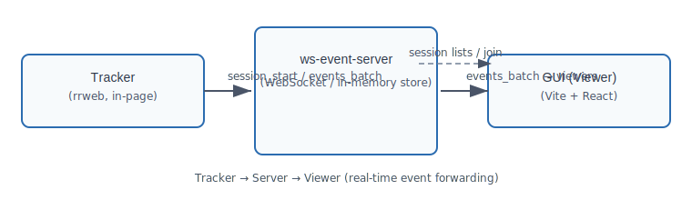

## ux-guru — local developer notes

Small local setup and a brief overview of how the pieces fit together.

## Projects (quick summary)

- `gui` — Vite + React viewer

  - Purpose: UI to list active sessions and watch session replays in near real time.
  - Key file: `src/hooks/useSessionReplayWebSocket.ts` (connects as `?type=viewer`).

- `tracking-script` — client recorder

  - Purpose: rrweb-based recorder injected into pages; batches events and sends them to the server.
  - Key file: `src/index.ts` (SessionTracker). Builds to `dist/tracker.js`.

- `ws-event-server` — central WebSocket relay + in-memory store
  - Purpose: accepts trackers + viewers, stores session data, and forwards event batches to viewers.
  - Key file: `src/server.ts` (handles `session_start`, `events_batch`, `viewer_join_session`, etc.).

## How they interact (message flow)

- Connections:

  - Tracker -> `ws://HOST:PORT/ws?type=tracker`
  - Viewer -> `ws://HOST:PORT/ws?type=viewer`

- Typical flow:

  1. Tracker connects, sends `session_start` (metadata).
  2. Server creates session and broadcasts `session_started` to viewers.
  3. Tracker records events (rrweb) and sends `events_batch` to the server.
  4. Server appends events and forwards `events_batch` to viewers who joined that session.
  5. Viewer can request `get_active_sessions` or `viewer_join_session` to receive `session_joined` (initial events + metadata).
  6. Tracker sends `session_end` on unload; server marks session inactive and notifies viewers.

- Key message types (summary):
  - `session_start`, `session_end`, `events_batch`, `heartbeat` (tracker -> server)
  - `get_active_sessions`, `session_joined`, `events_batch`, `session_started`, `session_ended` (server -> viewer)
  - `viewer_join_session`, `viewer_leave_session` (viewer -> server)



Figure: High-level data flow — Tracker records events, sends to Server, Server forwards to Viewer.

## Quick start (macOS / zsh)

1. Start the WebSocket server

```bash
cd ws-event-server
npm install
npm run dev
```

Server logs the WebSocket endpoint (e.g. `ws://localhost:8080/ws`).

2. Start the GUI

```bash
cd gui
npm install
npm run dev
```

Open: http://localhost:5173

3. Build and serve the tracker for local injection

```bash
cd tracking-script
npm install
npm run build --silent

# Serve the built files from dist (for local testing)
cd dist
python3 -m http.server 4500 --bind 127.0.0.1
```

Inject into any page (bookmarklet):

```javascript
javascript: (function () {
  var s = document.createElement("script");
  s.src = "http://127.0.0.1:4500/tracker.js";
  document.head.appendChild(s);
})();
```

## Testing / demo

- Open `demo.html` (serve with Live Server or any static server) to try the tracker injection.
- Or open the GUI and use the bookmarklet to load the local `tracker.js` into any page while the server is running.

## Troubleshooting

- If ports are already used, change the python server port (4500) or your dev server ports.
- If the GUI doesn't start, run `npm install` in `gui` and check the Vite output for errors.
- If the tracker fails to send events, verify `dist/tracker.js` is served and that the bookmarklet URL matches.
- If viewers see no sessions, ensure the tracker connected to the same server URL and that the server logged a `session_started`.

## Notes

- Sessions and events are stored in memory on the server; long runs may be trimmed by the server to prevent memory growth.
- Tracker batches events (default ~20) and flushes every ~500ms by default.
- The server path is `/ws` (check `ws-event-server` logs for the exact port).

If you'd like, I can add a short diagram image, move this into `README.md` root, or add a tiny start script that launches all three services locally.
